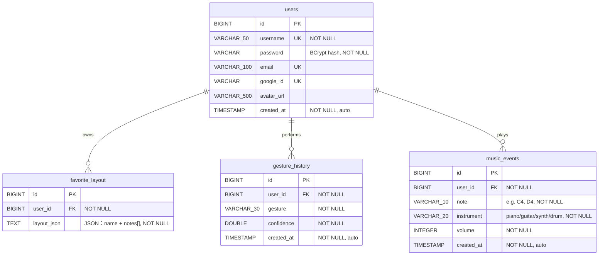

# AI Gesture Music Studio

用 webcam 手勢辨識即時演奏音樂的全端互動樂器專案。

架構：Python（MediaPipe 手勢辨識）→ Spring Boot（商業邏輯、JWT、WebSocket、PostgreSQL）→ Vue 3 Dashboard（Web Audio API 即時發聲）。

---

## 功能

- **手勢辨識**：MediaPipe Hands 辨識 8 種手勢（OPEN_HAND、FIST、THUMB_UP、THUMB_DOWN、POINTING、TWO_FINGERS、THREE_FINGERS、VICTORY），透過 WebSocket 即時傳送演奏指令
- **圓形音階 UI**：手指在攝影機畫面上劃過不同區域觸發對應音符，支援 piano / guitar / synth / drum 四種音色
- **自訂音階環**：拖拉介面可自由排列 8 個音符格子，支援儲存 / 載入多組 layout
- **Google OAuth + JWT**：支援 Google 一鍵登入與帳密註冊，Token 自動刷新
- **個人統計**：即時顯示今日音符數、累計音符、最常樂器、最常音符、最常手勢
- **在線人數**：STOMP WebSocket 即時顯示目前在線玩家
- **背景音樂**：Dashboard 自動播放 jazz 背景音，可一鍵切換

---

## 目前進度

- [x] **Step 1 — 建立專案架構**
- [x] **Step 2 — JWT 登入 / 註冊 + Google OAuth**
- [x] **Step 3 — AI 手勢辨識（MediaPipe）**
- [x] **Step 4 — WebSocket 即時同步（雙管線：指令型 + 演奏型）**
- [x] **Step 5 — Web Audio API 播放器 + 圓形音階 UI**
- [x] **Step 6 — Vue Dashboard + 自訂 Layout 編輯器**
- [x] **Step 7 — 個人統計 + 在線人數**

---

## 資料庫 ER 圖



---

## 專案結構

```
ai-gesture-music-studio/
├── backend/                        # Spring Boot 3.3 + Java 17 + PostgreSQL
│   └── src/main/java/.../
│       ├── model/                  # JPA Entity（4 張表）
│       ├── dao/                    # DAO interface + JPA impl
│       ├── dto/                    # Request / Response DTO
│       ├── service/                # Service interface + impl
│       ├── controller/             # REST + WebSocket controller
│       ├── security/               # JWT filter、SecurityConfig
│       └── util/                   # JwtService、CustomUserDetails
├── frontend/                       # Vue 3 + Vite + Tailwind v4 + Pinia
│   └── src/
│       ├── views/                  # LoginView、DashboardView
│       ├── components/             # GestureCamera、LayoutEditor、StatsModal
│       └── stores/                 # authStore、dashboardStore
└── gesture_ai/                     # Python + MediaPipe Hands + OpenCV
```

---

## 啟動方式

### Backend

需求：Java 17+、Maven、PostgreSQL。

```bash
# 1. 建立資料庫
createdb gesture_music_studio

# 2. 設定環境變數（密碼不要 commit）
export DB_USERNAME=postgres
export DB_PASSWORD=你的密碼

# 3. 啟動（Hibernate 自動建表）
cd backend
mvn spring-boot:run
```

### Frontend

```bash
cd frontend
npm install
npm run dev
# 開 http://localhost:5173
```

### Python AI Service

```bash
cd gesture_ai
pip install -r requirements.txt
python main.py
```

---

## 技術筆記

- **雙管線 WebSocket**：離散指令手勢（OPEN_HAND/FIST…）走 REST POST + 時間型 debounce；演奏型手勢（食指連續位置）走 STOMP WebSocket + 區域變化型 debounce。
- **Google OAuth**：使用 `renderButton` + 透明 overlay 技術解決 FedCM 在 HTTP 環境被封鎖的問題；私有 LAN IP 不在 Google 授權來源內，改用 `isLocalhost` 判斷隱藏按鈕。
- **JWT**：密鑰走 `${JWT_SECRET}` 環境變數注入，不寫死在 `application.yml`。
- **資料庫密碼**：同上，一律走環境變數。
- **音量控制**：手腕旋轉角度（palm rotation delta）控制，非 pinch，避免誤觸。
